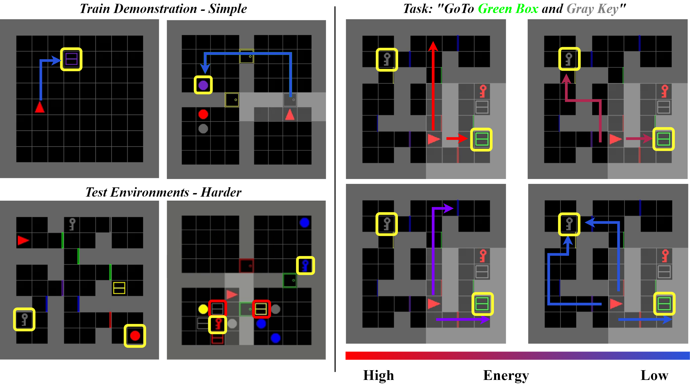

<p align="center">

  <h1 align="center">GenPlan: Generative Sequence Models as Adaptive Planners</h1>
  
  <p align="center" style="font-size:16px">
    <a href="https://aku02.github.io/"><strong>Akash Karthikeyan</strong></a>
    ·
    <a href="https://yashpant.github.io/"><strong>Yash Vardhan Pant</strong></a>
  </p>
  <p align="center" style="font-size:16px">University of Waterloo</p>

  <p align="center" style="font-size:16px">Accepted in AAAI 2025</p>

  <p align="center">
  <br>
    <a href='https://arxiv.org/abs/2412.08565'>arXiv Preprint</a>
    <a href='https://aku02.github.io/projects/genplan/' style='padding-left: 0.5rem;'>Project Page</a>
  </p>
  <div align="center">
  </div>

  
  <br/>
 
  
  ## Abstract 
  >Sequence models have demonstrated remarkable success in behavioral planning by leveraging previously collected demonstrations. However, solving multi-task missions remains a significant challenge, particularly when the planner must adapt to unseen constraints and tasks, such as discovering goals and unlocking doors. Such behavioral planning problems are challenging to solve due to: a) agents failing to adapt beyond the single task learned through their reward function, and b) inability to generalize to new environments, e.g., those with walls and locked doors, when trained only in planar environments. Consequently, state-of-the-art decision-making methods are limited to missions where the required tasks are well-represented in the training demonstrations and can be solved within a short (temporal) planning horizon. To address this, we propose \model: a stochastic and adaptive planner that leverages discrete-flow models for generative sequence modeling, enabling sample-efficient exploration and exploitation. This framework relies on an iterative denoising procedure to generate a sequence of goals and actions. This approach captures multi-modal action distributions and facilitates goal and task discovery, thereby generalizing to out-of-distribution tasks and environments, i.e., missions not part of the training data. We demonstrate the effectiveness of our method through multiple simulation environments. Notably, \model outperforms state-of-the-art methods by over $10\%$ on adaptive planning tasks, where the agent adapts to multi-task missions while leveraging demonstrations from single-goal-reaching tasks.
 </p>


## Install

We recommed installing using conda

```
git clone https://github.com/CL2-UWaterloo/GenPlan.git
cd GenPlan
env create -f env.yaml
conda activate plan
```
Installing the MiniGrid Environment 

```
git clone https://github.com/Aku02/Minigrid.git
cd Minigrid
pip install -e .
```

See the MiniGrid repository for information on how to get

## Usage

Refer to the configuration files in the `config` directory. We provide example for 2 envs

Activate conda environment and login to wandb (if you haven't already).

```
WANDB_MODE='online' python train_genplan.py
```

## Contact

In case of any issues, please email: [akashuwtce@gmail.com](mailto:akashuwtce@gmail.com)

## Acknowledgement

We thank the authors for sharing the code!

- [Decision Transformer](https://github.com/kzl/decision-transformer.git)
- [LEAP](https://github.com/hychen-naza/LEAP)
- [Discrete Flow Models](https://github.com/andrew-cr/discrete_flow_models.git)
- [Diffusion Policy](https://github.com/real-stanford/diffusion_policy)


## Citation

```bibtex
@misc{karthikeyan2024genplangenerativesequencemodels,
      title={GenPlan: Generative sequence models as adaptive planners}, 
      author={Akash Karthikeyan and Yash Vardhan Pant},
      year={2024},
      eprint={2412.08565},
      archivePrefix={arXiv},
      primaryClass={cs.LG},
      url={https://arxiv.org/abs/2412.08565}, 
}
```